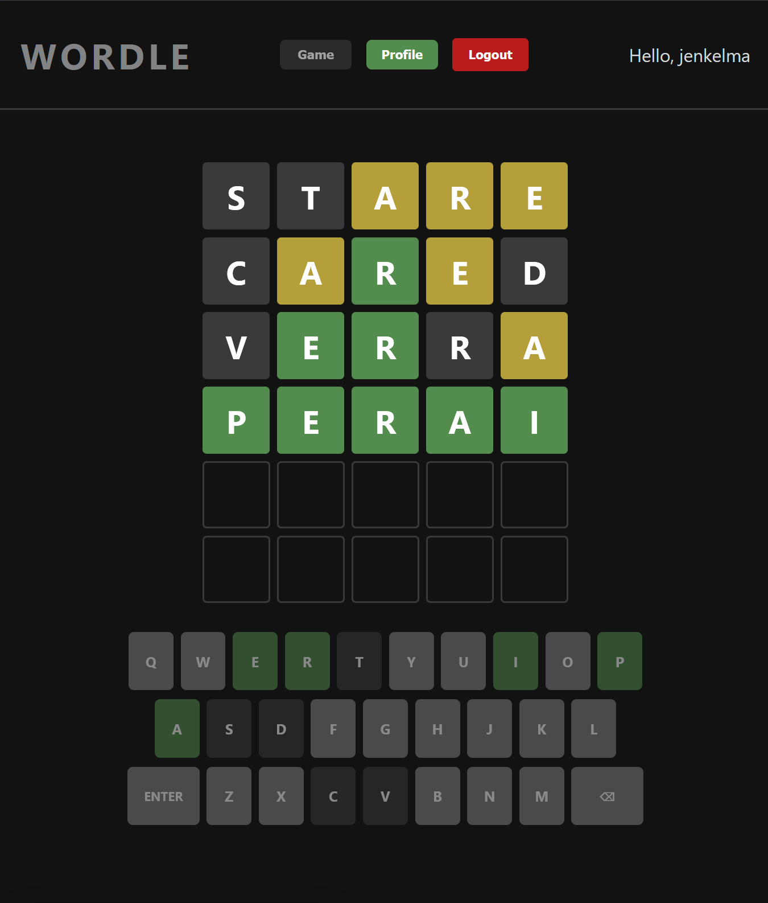

# Wordle Web Application

## Projektbeschreibung

Das Wordle Web Engineering Projekt ist eine Full-Stack-Implementierung des Worträtsel-Spiels als Web-Anwendung. Benutzer können sich registrieren oder einloggen, um Spiele zu spielen und ihre Fortschritte zu speichern. Das Ziel ist es, in maximal 6 Versuchen ein 5-Buchstaben-Wort zu erraten.

## Architektur und Features

- Frontend
  - Spiel:
    - Farbkodierung der Buchstaben für abgegebene Wörter
    - Flip Animation bei gültigen Wörtern
    - Vibration bei ungültigen Eingaben
  - Profile:
    - Anzeige der Statistiken
    - Übersicht fertig gespielter Spiele
    - Erstellen, Bearbeiten und Löschen von Spielalben
- API Gateway: HTTP Request Routing an entsprechende Backend Services
- Game Service
  - Bewertungsalgorithmus für Buchstaben-Feedback
  - Wortvalidierung gegen Wörterdatenbank
- User Service
  - Benutzerregistrierung mit Username, Email und Passwort
  - OAuth2-Authentifizierung über GitLab IMN-Account
  - JWT-basierte Authentifizierung mit automatischer Token-Erneuerung
- Profile Service
  - Berechnung der Statistiken: Anzahl gewonnener Spiele, Siegerate, Verteilung der Versuche
  - Speicherung der Spielhistorie und der personalisierbare Spielalben
- Wörterdatenbank
  - Externe Git-Repository als Quelle
  - Fallback auf hardcodierte Wortliste
- PostgreSQL Datenbank
  - Relationale Datenbank für Benutzer- und Spieldaten
  - Zugriff über DataAccessService-Layer

Alle Services laufen in seperaten Docker-Containern mit klarer Trennung der Verantwortlichkeiten.

**Live-URL:** https://devstud.imn.htwk-leipzig.de/dev11

**Source Code:** https://gitlab.dit.htwk-leipzig.de/web-engineering-2025-wordle

#

_Entwickelt im Rahmen des Moduls "Web Engineering (C227)" - Sommersemester 2025_
